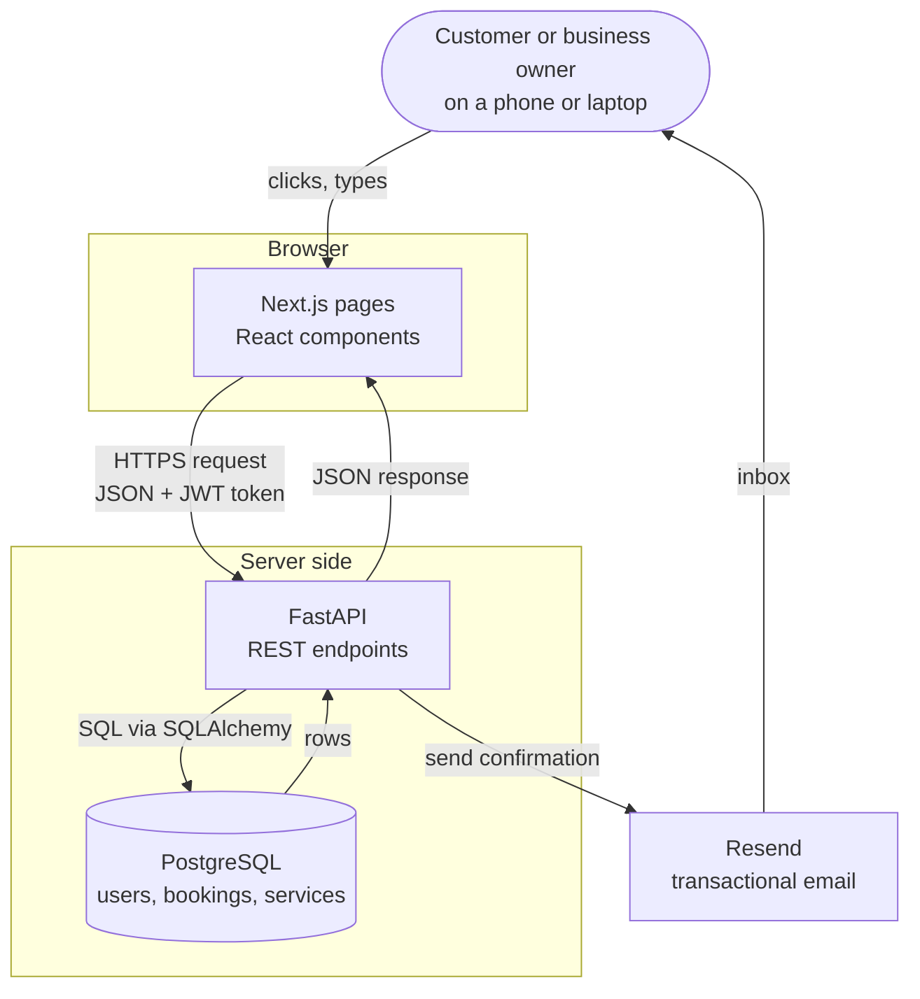
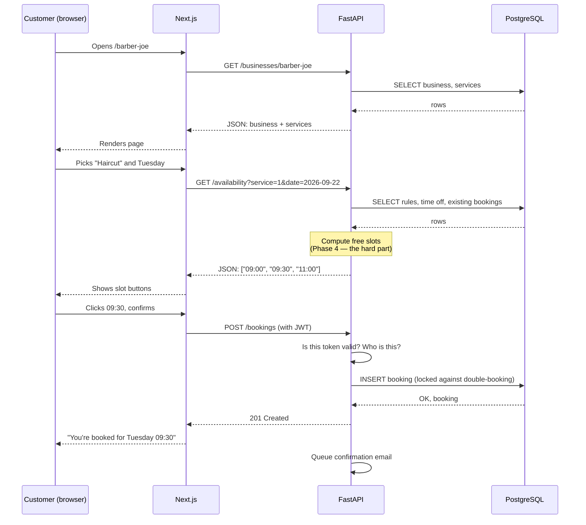
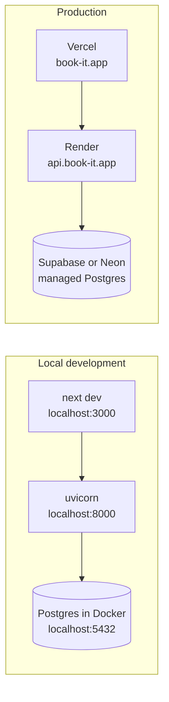

# Book-it architecture

How the three pieces of Book-it fit together, and what happens when a customer books
an appointment.

## The three pieces

Book-it is split into three separate programs that talk to each other over the network.

| Piece | What it is | Its one job |
|---|---|---|
| **Frontend** | Next.js (TypeScript, Tailwind) | Draw the screens a human looks at |
| **Backend** | FastAPI (Python) | Decide what is allowed and what is true |
| **Database** | PostgreSQL | Remember things after the power goes out |

**Analogy.** Think of a restaurant. The *frontend* is the dining room and the menu —
it's what the customer sees and touches. The *backend* is the kitchen — it takes orders,
decides "we're out of salmon," and does the real work. The *database* is the walk-in
fridge — it's where everything is actually stored, and only the kitchen is allowed in.
Customers never walk into the fridge themselves.

That last sentence is the important one: **the browser never talks to PostgreSQL.**
It only ever asks the backend, and the backend decides whether to answer.

## How they talk

Three things to notice:

1. **The arrow between UI and API is JSON over HTTPS.** That's the contract between
   frontend and backend. As long as both sides agree on the shape of that JSON, either
   side can be rewritten without touching the other.
2. **Only the backend touches the database.** This is what lets us enforce rules. If the
   frontend could write to the database directly, anyone could open their browser console
   and book a slot that doesn't exist, or cancel someone else's appointment.
3. **Email is fire-and-forget.** The API responds to the customer immediately and sends
   the email in the background. Nobody should stare at a spinner because Resend is slow.

## What happens when someone books a slot

This is the single most important flow in the app, so it's worth tracing end to end.

The `Note` box is where the real engineering lives. Turning "these are my open hours,
minus my holidays, minus what's already booked, chopped into 30-minute pieces" into a
correct list of slots is the heart of Book-it, and it's why Phase 4 gets two full weeks
and tests written before the code.

## Why three pieces instead of one program

A single program that renders HTML and talks to the database directly would be simpler
to start. We're splitting it anyway, for three reasons:

- **The frontend and backend scale and deploy differently.** Vercel is very good at
  serving pages fast worldwide; Render is fine at running a Python process near the
  database. Splitting lets each go where it's best.
- **A JSON API can serve things that aren't a website.** A mobile app, or a business
  owner's own site embedding a booking widget, would use the exact same endpoints.
- **It's the shape most jobs actually use.** This is a portfolio project, and this
  split is the thing employers expect to see.

The cost is real: two languages, two deploys, and CORS configuration. That's a fair
trade here.

## Local versus production

The same three pieces, running in different places.

Two rules that follow from this diagram:

- **Nothing is hardcoded to `localhost`.** Every address and password comes from an
  environment variable, so the same code runs in both columns. Secrets live in `.env`
  files locally and in the host's dashboard in production — never in git.
- **All times are stored in UTC.** The database, the API, and the tests all speak UTC.
  We convert to the customer's local time only at the very last moment, in the browser.
  Getting this wrong is the classic way booking apps break, and it usually shows up as
  "my 9am appointment says 4am" the first time someone travels.

## Data flow rules of thumb

- The browser holds a **JWT** (a signed token proving who you are) and sends it with
  every request that isn't public. The backend re-checks it every single time — it never
  trusts that the frontend hid a button.
- The backend validates **all** input with Pydantic, even input the frontend already
  validated. Frontend validation is a courtesy to honest users; backend validation is
  the actual rule.
- The database has the final say on conflicts. Even if the backend checks "is this slot
  free?", a unique constraint in PostgreSQL is what actually prevents two people who
  click at the same millisecond from both getting 09:30.
