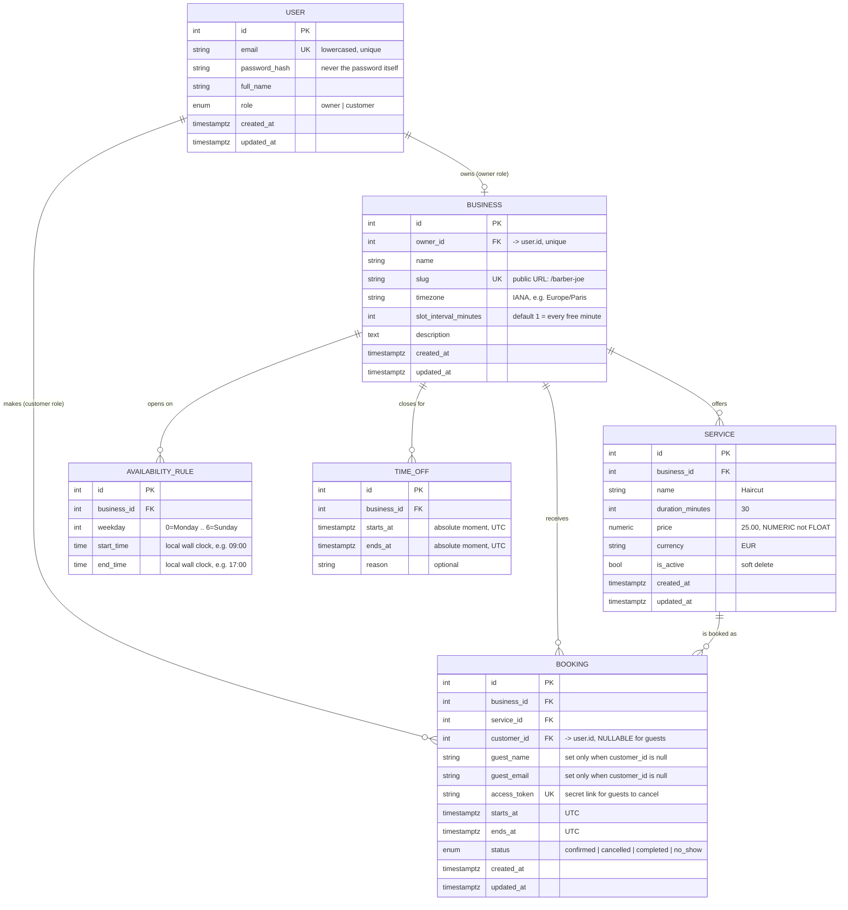

# Book-it data model

Six tables. This document explains what each one holds, why it is shaped that way, and
the handful of decisions that would be painful to change later.

## Entity relationship diagram



## The tables

### User

Everyone with a login. `role` distinguishes a business owner from a customer. The
password column stores a **hash**, never the password itself — covered in Phase 3.

Email is stored lowercased and unique, because `Bob@x.com` and `bob@x.com` are the same
person, and letting both exist creates two accounts nobody can tell apart.

### Business

One barbershop, clinic, or tutor. `slug` is the public URL segment (`/barber-joe`), so it
is unique and URL-safe. `timezone` is the field most beginner booking apps forget; it has
its own section below.

### Service

Something a customer can book: name, how long it takes, what it costs.
`duration_minutes` is what turns opening hours into bookable slots — a 30-minute haircut
and a 90-minute massage carve up the same afternoon very differently.

### AvailabilityRule

The recurring weekly pattern: "open Tuesdays 09:00-17:00". One row per block, so a shop
that closes for lunch has **two** rows for Tuesday (09:00-12:00 and 14:00-18:00). That
flexibility is exactly why this is a separate table instead of columns on Business.

### TimeOff

Specific exceptions that override the weekly pattern: holidays, a dentist appointment, a
closed afternoon. Subtracted from availability when computing slots.

### Booking

One appointment. Status is an enum rather than free text, so a typo can never create a
phantom state. Cancelled bookings are **kept**, not deleted — the owner's stats need the
cancellation rate, and deleted rows cannot be counted.

A booking belongs either to a registered customer (`customer_id`) or to a guest
(`guest_name` + `guest_email`), never to both and never to neither. See section 7.

---

## Six decisions worth understanding

### 1. Business carries a timezone, and it is not optional

An owner sets "Tuesdays 09:00-17:00". Nine in the morning **where**? The same instant is
09:00 in Paris and 03:00 in New York. Without a timezone on the business, the hours are
meaningless.

So the app deals in two different kinds of time, and they use two different column types:

| Concept | Example | Type | Why |
|---|---|---|---|
| A recurring wall-clock pattern | "Tuesdays 09:00-17:00" | `TIME` | Repeats weekly; has no single moment |
| A specific moment in history | "24 Dec 2026, 14:30 UTC" | `TIMESTAMPTZ` | Happened exactly once, everywhere at once |

Availability rules are wall-clock. Bookings and time off are absolute moments, stored in
UTC. The business timezone is the converter between the two.

This also handles daylight saving correctly. "Tuesdays 09:00" in Paris is 08:00 UTC in
winter and 07:00 UTC in summer. Because we store the *rule* as local time and convert at
calculation time, the shop opens at 9am all year without anyone editing anything. Had we
stored the rule in UTC, every business would silently shift by an hour twice a year.

### 2. Booking stores `ends_at` even though it could be computed

You could derive the end from `starts_at + service.duration_minutes`. We store it anyway.

If the owner changes a haircut from 30 to 45 minutes next month, every past booking would
retroactively claim to have been 45 minutes long, and appointment history would quietly
rewrite itself. A booking records **what actually happened**, so it keeps its own copy.
This duplication is deliberate and correct.

It also makes overlap detection a plain comparison of two stored columns, which the next
decision depends on.

### 3. The database prevents double-booking, not the Python code

The obvious approach — "check if the slot is free, then insert" — has a gap between the
check and the insert. Two customers clicking at the same moment can both pass the check,
and both get 09:30.

PostgreSQL can enforce this properly with an **exclusion constraint**:

```sql
CREATE EXTENSION IF NOT EXISTS btree_gist;

ALTER TABLE booking ADD CONSTRAINT no_overlapping_bookings
EXCLUDE USING gist (
    business_id WITH =,
    tstzrange(starts_at, ends_at) WITH &&
) WHERE (status = 'confirmed');
```

In English: *for the same business, no two confirmed bookings may have overlapping time
ranges.* `&&` means "overlaps". The `WHERE` clause means cancelled bookings do not block
the slot they used to hold — which is the whole point of cancelling.

Two people can now click simultaneously and the database will reject one of them, no
matter how the application code is written. We will still write the friendly check in
Python so the loser gets a clear message instead of a 500 error, but the constraint is
what makes it actually true. Phase 4 tests this with genuinely concurrent requests.

### 4. Services are deactivated, never deleted

`is_active` instead of `DELETE`. If an owner removes "Haircut" while ten future bookings
reference it, either those bookings break or they vanish. Flipping `is_active` to false
hides it from the booking page while every existing booking stays intact and readable.

This is the standard pattern for anything that history points at.

### 5. Money is `NUMERIC`, never `FLOAT`

`FLOAT` cannot represent 0.10 exactly. Add it up enough times and totals drift by
fractions of a cent — the kind of bug that surfaces in front of a customer.
`NUMERIC(10,2)` is exact decimal arithmetic. A `currency` column sits beside it, because
a bare number is not a price.

### 6. One business per owner (for now)

`business.owner_id` is unique: one owner, one business. A chain with three locations
cannot be modelled yet.

This is a real limitation, chosen on purpose. Dropping a `UNIQUE` constraint later is a
one-line migration; rewriting every screen and endpoint that assumed a single business is
not. Build the simple thing, and let a real need justify the complexity.

---

## 7. Guest booking: no account required

A customer may book with just a name and an email address. This means `customer_id` is
**nullable**, and two guest columns sit beside it. A booking is therefore valid in exactly
one of two shapes, enforced by a check constraint so a half-filled row cannot exist:

```sql
ALTER TABLE booking ADD CONSTRAINT booking_has_a_customer CHECK (
    (customer_id IS NOT NULL AND guest_name IS NULL AND guest_email IS NULL)
    OR
    (customer_id IS NULL AND guest_name IS NOT NULL AND guest_email IS NOT NULL)
);
```

Without that constraint, nothing stops a row with no customer at all — an appointment
belonging to nobody, which no code downstream would know how to display.

### How a guest cancels

A logged-in customer proves who they are with a JWT. A guest has no login, so the
confirmation email carries a secret link:

```
https://book-it.app/b/9f3a1c7e8d2b4a6f...
```

`access_token` is a long random value, unique per booking. Knowing it is what authorises
cancelling or rescheduling that one booking — a capability URL. Three rules follow:

- It must come from a cryptographic random source (`secrets.token_urlsafe`), never from
  anything guessable like an id, a timestamp, or a counter.
- It grants access to exactly one booking and nothing else.
- Anyone holding the link holds the power, so it goes in the email body and never in a
  page the search engines can reach.

Logged-in bookings get a token too. It costs nothing and keeps one cancellation path
instead of two.

### What this costs

Guest booking converts far better — no signup wall in front of a haircut. The price is
paid in Phases 4 and 6: every place that handles a booking must cope with `customer_id`
being null, and "my bookings" can only ever show the logged-in half. That is a fair trade
for a real product, but it is genuinely more edge cases than an account-only design.

---

## Decisions taken

Settled on 2026-09-16. Recorded here so the reasoning is not lost.

| Question | Decision | Consequence |
|---|---|---|
| One person, both roles? | **No — single role for v1** | A barber booking a tutor needs a second account. Fixable later with an `owner_profile` table. |
| Availability per business or per service? | **Per business** | The shop is open or closed; every service is bookable during open hours. Keeps the Phase 4 algorithm tractable. |
| Fixed slot grid? | **No — every free minute** | `slot_interval_minutes` defaults to `1`. Maximum packing; a long list for the customer. Stored as a column so it can be raised to 15 or 30 without touching the algorithm. |
| Account required to book? | **No — guest booking allowed** | `customer_id` nullable, guest columns plus a check constraint, and a token link for cancelling. Better conversion, more edge cases. |
